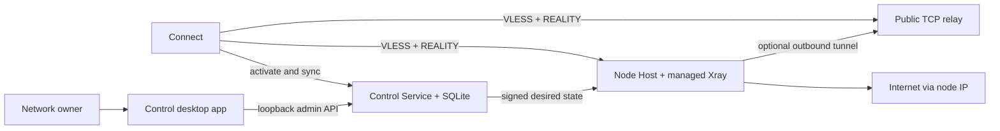

# Private Network

面向亲友小规模使用的自托管私人网络。网络所有者通过 **Control** 管理朋友账号和出口节点，
节点所有者安装 **Node Host** 并粘贴一次性邀请码，普通成员安装 **Connect** 后用一个账号自动
同步全部可用节点。

数据面使用固定版本的 `Xray + VLESS + REALITY`；REALITY 是内部协议细节，不是产品名称。

> [!IMPORTANT]
> 当前项目是 `0.1.0` 预发布版本，适合受信任的亲友测试，不是已验收的商业 VPN 产品。
> 本机开发签名和 unsigned-validation 安装包不能作为公开发行版本。Developer ID、Apple
> notarization、Windows Authenticode 和完整 clean-machine 验收仍是正式发布门槛。

## 使用入口

- **网络所有者、节点贡献者和普通成员：** [完整使用指南](./docs/USER_GUIDE.md)
- **当前可执行的 macOS 运维路径：** [MVP Operations](./docs/MVP_OPERATIONS.md)
- **构建、签名和发行：** [Release Guide](./RELEASE.md)
- **系统架构：** [System Architecture](./docs/SYSTEM_ARCHITECTURE.md)
- **安全边界：** [Security](./docs/SECURITY.md)

## 解决什么问题

Private Network 将传统的“给每个朋友发一条 VLESS 链接”改成账号和节点分离的模型：

- 一个朋友对应一个账号，不共享 UUID。
- 一个账号可以同时分配到多个节点。
- 节点新增、禁用、撤销或配置变更后，Connect 自动同步。
- 节点拥有者可以在本机暂停共享并设置流量、带宽和并发限制。
- Control 汇总节点状态、配置版本、下发结果和最小化流量统计。
- 公网可直连时使用直接入口；公寓网络、CGNAT 或不可控路由器环境可使用原始 TCP 中继。
- Control UI、Control Service、Node Host 和 Connect 各自独立，关闭窗口不会停止后台节点。

## 当前能力边界

| 能力 | 当前状态 |
| --- | --- |
| Control 管理节点、账号、分配和一次性登录码 | 已实现 |
| macOS Node Host 系统 LaunchDaemon 和本机控制 UI | 已实现 |
| macOS Connect、账号登录、自动同步和节点选择 | 已实现 |
| Windows Connect 构建路径 | 已实现，仍需签名和 clean-machine 验收 |
| 多节点分配、跨节点禁用/删除、配置版本和回滚 | 已实现 |
| HTTP/SOCKS 系统代理恢复 | 已实现 |
| TUN/Network Extension 全设备 VPN | **未实现** |
| UDP 转发 | **未实现**；当前数据面为 TCP |
| 公网正式发行包和自动更新 | 尚未通过发布验收 |
| 商业计费、客服和 SLA | 不在当前范围 |

Connect 当前通过本地 HTTP/SOCKS 代理和操作系统代理设置工作。遵循系统代理的应用会自动走
Private Network；忽略系统代理的应用、原始 UDP 流量和要求 TUN 的软件不会被强制接管。

## 系统架构



控制面和数据面严格分离：

- **Control Service** 保存账号、节点、设备、分配、配置版本和审计状态，不转发朋友流量。
- **Node Host** 持有节点身份、REALITY 私钥和 Xray 运行时，并作为最终互联网出口。
- **Relay** 只做原始 TCP 转发，不能解密 VLESS/REALITY；使用 relay 时最终出口仍是节点网络的 IP。
- **Cloudflare Tunnel** 可以发布 Control 的 HTTPS API，但不是普通 Connect 客户端的 REALITY
  TCP 数据面替代品。

## 应用与服务

| 组件 | 目录 | 作用 |
| --- | --- | --- |
| Control | `src/`, `src-tauri/` | 网络所有者桌面管理器 |
| Control Service | `control-server/` | 轻量 Rust + SQLite 中央控制服务 |
| Node Host | `node-host/` | 节点身份、同步、Xray、策略和遥测核心 |
| Node Host App | `node-host-app/` | 节点所有者的安装、配对和状态 UI |
| Connect | `client/` | 普通成员的 macOS/Windows 客户端 |
| Relay Server | `relay-server/` | 可选的认证原始 TCP 中继 |
| Probe Worker | `probe-worker/` | 可选的外部 TCP 预检执行器 |
| Shared crates | `crates/` | 协议、Xray runtime、relay provisioning 和 release manifest |
| Packaging | `packaging/`, `scripts/release/` | 服务定义、安装器、签名和验收工具 |

## 技术栈

- Tauri 2、React 19、TypeScript、Vite、Tailwind CSS、shadcn/ui 和 Radix UI 构建桌面应用。
- Rust 实现 Control backend、Control Service、Node Host、Connect runtime、relay 和共享协议。
- SQLite 作为小规模网络的权威控制数据库和本地状态存储，不要求 PostgreSQL、Redis 或消息队列。
- Xray-core 作为固定版本、SHA-256 校验的数据面 sidecar。
- FRP + Caddy 是当前 Vultr 手工 relay 模板；仓库内 `relay-server` 是独立的 managed relay 实现。
- 可选 Cloudflare Worker 只执行隐私最小化的外部 TCP preflight。

## 推荐部署

### 家庭节点有可用公网入口

```text
Connect -> home public TCP port -> Node Host admission gate -> Xray backend -> Internet
```

路由器将公网 TCP 端口转发到节点，或由 Node Host 在明确授权后尝试 PCP/NAT-PMP/UPnP。
动态公网 IP 可以配合 DDNS；静态 IP 不是协议要求。

### 公寓网络、CGNAT 或无法端口转发

```text
Connect -> VPS:443 -> raw TCP tunnel -> Node Host private Xray backend -> Internet
```

VPS 只提供稳定入口，朋友最终看到的仍是节点家宽出口 IP。本仓库包含
[Vultr + FRP 部署模板](./deploy/vultr-relay/README.md)。这也是小规模亲友网络的推荐路径。

### 控制面公网地址

Node Host 和 Connect 在其他机器上使用一次性邀请码前，Control Service 必须有稳定 HTTPS
origin。可选方案包括：

- Cloudflare Tunnel，只转发 `http://127.0.0.1:8787` 的控制 API。
- VPS 上的 Caddy/Nginx 反向代理。
- 将 Control Service 单独部署在 Linux VPS。

不要把 Control Service 的 `8787` 端口直接暴露到公网。

## 从源码开始

### 前置条件

- macOS 作为当前完整的 Control/Node Host 开发和运行平台。
- Node.js `22.17.0`、npm、Rust `1.88.0` 或兼容版本。
- Xcode Command Line Tools。
- Xray `26.3.27`；发布工具会校验固定版本和 SHA-256。
- 构建 Windows Connect 时需要 Windows x86_64 构建环境。

安装依赖：

```bash
npm ci
npm --prefix client ci
npm --prefix node-host-app ci
npm --prefix probe-worker ci
```

如果只在 macOS 本机启动 Control Service：

```bash
brew install xray

python3 scripts/product/control-service.py install \
  --network-name "Friends Network" \
  --xray-path /opt/homebrew/bin/xray

python3 scripts/product/control-service.py status
```

本地开发 UI：

```bash
npm run tauri -- dev
npm --prefix node-host-app run tauri -- dev
npm --prefix client run tauri -- dev
```

本机 loopback origin 只适合单机开发。给其他电脑生成邀请码前，必须按
[使用指南](./docs/USER_GUIDE.md#3-发布-control-service) 配置公开 HTTPS origin。

## 本地 macOS 构建

首次创建本机开发签名身份：

```bash
scripts/release/setup-local-macos-signing.sh
```

构建三个本机签名 App：

```bash
npm run bundle:macos:local
npm --prefix node-host-app run bundle:macos:local
npm --prefix client run bundle:macos:local
```

输出位于各应用的 `src-tauri/target/<target>/release/bundle/`。本机身份仅用于开发验证；Node
Host 系统 `.pkg`、公开签名、notarization 和 Windows 安装器请按 [RELEASE.md](./RELEASE.md)
执行，不能把本机 bundle 重新命名为正式发行版。

## 常用测试

前端和 Tauri 应用：

```bash
npm run build
cargo test --manifest-path src-tauri/Cargo.toml

npm --prefix node-host-app run build
cargo test --manifest-path node-host-app/src-tauri/Cargo.toml

npm --prefix client run build
cargo test --manifest-path client/src-tauri/Cargo.toml
```

核心服务：

```bash
cargo test --manifest-path control-server/Cargo.toml
cargo test --manifest-path node-host/Cargo.toml
cargo test --locked --manifest-path relay-server/Cargo.toml
cargo test --locked --manifest-path crates/control-protocol/Cargo.toml
cargo test --locked --manifest-path crates/xray-runtime/Cargo.toml
```

严格检查和打包脚本：

```bash
cargo clippy --manifest-path node-host/Cargo.toml --all-targets -- -D warnings
python3 -m unittest discover -s scripts/product/tests -v
packaging/macos/tests/script-command-paths-exist.sh
packaging/macos/tests/preinstall-keeps-service-running.sh
packaging/macos/tests/service-state-rollback.sh
packaging/macos/tests/uninstall-node-host.sh
```

完整发布矩阵、SBOM、生命周期和网络验收命令位于 [RELEASE.md](./RELEASE.md) 和
[Release Acceptance](./docs/RELEASE_ACCEPTANCE.md)。

## 数据与后台进程

默认 macOS 路径：

| 数据 | 路径 |
| --- | --- |
| Control Service | `~/Library/Application Support/Private Network/Control Service/` |
| Control LaunchAgent | `~/Library/LaunchAgents/com.private-network.control-service.plist` |
| Node Host App | `/Applications/Private Network Node.app` |
| Node Host releases | `/Library/Application Support/Private Network Node/releases/` |
| Node Host state | `/Library/Application Support/Private Network Node/service-state/` |
| Node Host LaunchDaemon | `/Library/LaunchDaemons/com.sky.realitynode.agent.plist` |
| Node Host logs | `/Library/Logs/Private Network Node/` |
| Connect secrets | macOS/Linux：`~/Library/Application Support/com.sky.realityclient/` 下的 `credentials-v1.json` 和按需创建的 `profile-credentials-v1.json`（目录 `0700`、文件 `0600`）；Windows：Credential Manager |

Control UI、Node Host UI 可以关闭。Control Service 和 Node Host 由 launchd 独立运行；但
Mac 进入系统睡眠后网络服务会暂停。需要持续可用时应使用保持唤醒的 Mac mini，或在明确理解
电源和锁屏区别后配置仅阻止系统睡眠的工具。锁屏本身不会停止后台服务。

Connect 会自动保存当前设备密钥、refresh credential 和账号绑定。macOS/Linux 不访问
Keychain；这些数据由当前用户独占的应用文件保存。Windows 继续使用 Credential Manager。

## 安全原则

- 每位朋友使用独立账号；不要多人共享 Connect 登录码或底层 UUID。
- Node 和 Connect setup code 都是短期、单次秘密，不要提交到 Git、日志或公开聊天。
- 管理 token 只保存在 owner-only Control Service 配置中。
- Node Host 私钥、配置和数据库由 `_privnetnode` 专用系统账号持有。
- 配置先验证再激活；失败时保留或恢复 last-known-good revision。
- 禁用是可恢复操作；删除账号、撤销节点和 purge uninstall 是终止操作。
- 中继只转发密文，但中继提供者仍能观察连接时间、源 IP、目标端口和流量大小。
- 使用者必须遵守节点和客户端所在地区的法律、网络服务条款和内容规则。

## 文档地图

| 文档 | 内容 |
| --- | --- |
| [USER_GUIDE.md](./docs/USER_GUIDE.md) | 完整安装、使用、运维和排障 |
| [MVP_OPERATIONS.md](./docs/MVP_OPERATIONS.md) | 当前可执行的 macOS 产品运维命令 |
| [REQUIREMENTS.md](./REQUIREMENTS.md) | 产品范围、角色和验收标准 |
| [IMPLEMENTATION_PLAN.md](./IMPLEMENTATION_PLAN.md) | 依赖顺序、阶段和提交门槛 |
| [SYSTEM_ARCHITECTURE.md](./docs/SYSTEM_ARCHITECTURE.md) | 运行边界和部署拓扑 |
| [CONTROL_PROTOCOL.md](./docs/CONTROL_PROTOCOL.md) | enrollment、sync、account、bundle、telemetry API |
| [NODE_HOST.md](./docs/NODE_HOST.md) | 节点生命周期和公网可达性 |
| [NODE_HOST_SYSTEM_SETUP.md](./docs/NODE_HOST_SYSTEM_SETUP.md) | macOS 正式系统服务和安全 IPC |
| [RELAY_PROVISIONING.md](./docs/RELAY_PROVISIONING.md) | 内置 relay 的分配、凭据和撤销 |
| [DATA_MODEL.md](./docs/DATA_MODEL.md) | Control 和本地持久化模型 |
| [ROLLOUT_AND_RECOVERY.md](./docs/ROLLOUT_AND_RECOVERY.md) | 配置收敛、回滚和恢复 |
| [SECURITY.md](./docs/SECURITY.md) | 信任边界、凭据和隐私 |
| [Connect Requirements](./docs/client/REQUIREMENTS.md) | Connect 产品行为和验收标准 |
| [Connect Architecture](./docs/client/ARCHITECTURE.md) | Connect runtime、缓存和系统代理 |
| [RELEASE.md](./RELEASE.md) | 构建、签名、SBOM 和发行 |
| [RELEASE_ACCEPTANCE.md](./docs/RELEASE_ACCEPTANCE.md) | 不可伪造的发布验收证据 |
| [COMPLETION_AUDIT.md](./docs/COMPLETION_AUDIT.md) | 实现完成度和剩余 release gate |

`DESIGN.md` 是视觉参考，不覆盖上述产品、架构、协议或安全文档。

## 仓库状态

仓库目前标记为 private package，尚未包含公开许可证。不要假设第三方拥有复制、修改或重新
分发权限。若准备公开开源，应先补充明确许可证、贡献指南、安全报告流程和生产信任根。
