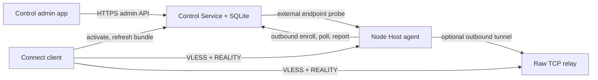

# System Architecture

Status: authoritative runtime and data ownership design.

## 1. Runtime Topology



The operator's Mac may run Control, Control Service, Node Host, and Xray together. They remain
separate process and storage boundaries so the UI can close without stopping service and a future
Linux deployment does not require Tauri.

Remote contributors run Node Host only. They are centrally managed nodes even though they have no
administrator panel.

## 2. Control Plane Versus Data Plane

The Control Service handles identities, desired state, signed profile bundles, health, and
telemetry. It never proxies ordinary member traffic.

The data plane is either:

```text
Connect -> direct node endpoint -> node Xray -> Internet
```

or:

```text
Connect -> raw TCP relay -> node Xray -> Internet
```

The relay cannot decrypt VLESS/REALITY. It adds availability and reachability cost but preserves the
node's Internet exit IP. Cloudflare Tunnel is limited to HTTP control APIs.

## 3. Process Boundaries

### Control

- Tauri UI and Rust application service for operator workflows.
- Holds an administrator session in the OS credential store.
- Does not own the authoritative database and may be closed independently.
- May invoke local-only maintenance actions through an authenticated loopback channel.

### Control Service

- Standalone Rust binary using an embedded SQLite database in WAL mode.
- Exposes versioned JSON APIs over HTTPS through a reverse proxy or tunnel.
- Owns accounts, devices, nodes, assignments, revisions, profile bundles, telemetry cursors, and
  audit events.
- Uses desired state plus polling; no Redis, message broker, or mandatory WebSocket is required.

### Node Host

- Background service started by launchd, Windows Service Manager, or systemd.
- Owns node identity, provider policy, Xray private material, config backups, local telemetry queue,
  and the Xray child process.
- Polls desired state with conditional requests and reports state independently.
- Has a small owner UI that communicates with the local service; the UI is not required to remain
  open.

### Connect

- Tauri application with bundled Xray, account session, signed bundle cache, selection policy, and
  OS proxy integration.
- Stores refresh tokens and connection secrets in the OS credential store.
- Continues using an unexpired cached bundle while the Control Service is unavailable.

### Relay

- Small public service that authenticates Node Host tunnels and maps an assigned endpoint to one
  raw TCP stream target.
- Does not store member credentials, Xray private keys, or detailed destination telemetry.
- Is optional for publicly reachable nodes.

## 4. Identity Model

- `network_id`: one private network owned by an operator. The initial release hosts one network per
  Control Service instance while retaining this ID in every table and token.
- `admin_id`: operator identity used for privileged API and audit events.
- `user_id`: stable logical member identity.
- `device_id`: one Connect installation, independently revocable.
- `node_id`: one Node Host installation, independently revocable.
- `credential_id`: one user/node VLESS credential.
- `revision`: immutable desired configuration revision.
- `bundle_id`: immutable signed client profile bundle.

Names, labels, email-like Xray tags, public endpoints, and countries are mutable presentation or
operational properties, never identities.

## 5. Data Ownership

### Control Service database

```text
networks
admins
users
devices
node_invitations
nodes
node_endpoint_candidates
node_endpoint_verifications
user_node_assignments
user_node_credentials
config_revisions
node_revision_results
profile_bundles
refresh_sessions
telemetry_cursors
traffic_samples
connection_events
audit_events
```

### Node Host local database

```text
node_identity
provider_policy
controller_registration
applied_revision
config_backups
telemetry_queue
reachability_results
relay_assignment
```

### Connect local state

```text
account metadata
signed bundle cache
node health history
selection policy
proxy recovery record
```

Refresh credentials, node credentials, user VLESS UUIDs, and REALITY private keys live in an OS
credential store or owner-only secret file, not in ordinary metadata rows.

## 6. Desired-State Lifecycle

1. An admin mutation commits the logical change and a new immutable revision in one transaction.
2. A node requests desired state after its last known revision.
3. The node verifies authenticity and schema compatibility, persists `received`, and validates the
   generated Xray config.
4. The node snapshots the current config, atomically activates the candidate, restarts Xray, and
   performs a bounded health check.
5. Success records `applied`; failure restores the snapshot and records `rolled_back` with a stable
   diagnostic code.
6. Repeated delivery of the same revision returns the existing result and does not restart Xray.

## 7. Reachability Strategy

Node Host evaluates modes in this order:

1. Existing public endpoint supplied by a VPS/provider.
2. Existing explicit router mapping.
3. Consent-gated automatic UPnP IGD, NAT-PMP, or PCP mapping.
4. Assigned raw TCP relay.

Only a controller-side probe can mark an endpoint `verified`. Local listening and public-IP
detection are useful diagnostics but do not prove external reachability. A management overlay such
as Tailscale may secure operations but does not by itself make the Xray endpoint available to
ordinary Connect clients.

## 8. Offline And Failure Behavior

- Control UI unavailable: no service impact.
- Control Service unavailable: cached clients and applied nodes continue; mutations and telemetry
  synchronization wait.
- Node Host unavailable: only that node is removed by client health selection; other nodes work.
- Relay unavailable: direct nodes work; relay-backed nodes are temporarily unavailable.
- Bad desired revision: node keeps or restores prior revision.
- Corrupt local state: service refuses destructive regeneration, exposes recovery status, and uses
  last known backup where integrity can be proven.

## 9. Deployment Profiles

### Initial home deployment

- Control Service and local Node Host run as background services on the operator's powered Mac.
- An HTTP tunnel or reverse proxy exposes only account and synchronization APIs.
- Router forwarding exposes the local Xray data endpoint.
- Daily SQLite backup and config backup are copied outside the application data directory.

### Optional public deployment

- The same Control Service binary runs behind Caddy on a small Linux VPS.
- Nodes continue outbound polling; no protocol changes are required.
- A relay may run on that VPS as a separate least-privileged process.

## 10. Architectural Decisions

- Do not depend on Remnawave at runtime; use its public behavior and API concepts as reference only.
- Do not build on Supabase, PostgreSQL, Redis, or a queue for the initial scale.
- Do not couple background service lifetime to a desktop window.
- Do not expose Xray configuration or service credentials to renderers.
- Do not require a persistent socket; conditional polling and ordered uploads are sufficient.
- Do not solve CGNAT by pretending control connectivity equals data-plane reachability.
