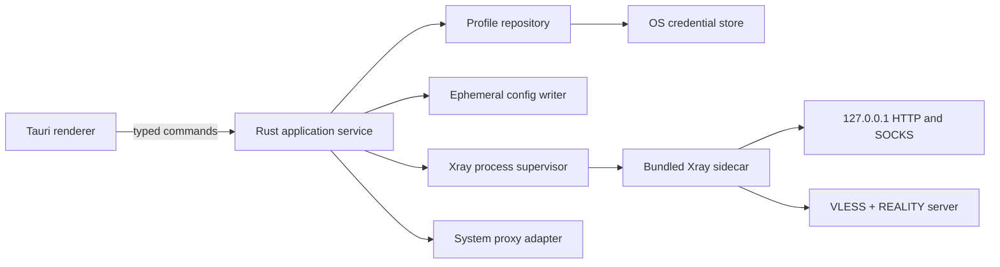

# Reality Client Architecture

## 1. Repository Boundary

The client lives in `client/` as an independent Tauri application. The existing repository root
remains the local server management app. Keeping separate package manifests and Tauri configs
prevents client packaging changes from destabilizing the server console.

```text
reality-console/
├── src/                    # existing server console frontend
├── src-tauri/              # existing server console backend
├── client/
│   ├── src/                # client frontend owned by the UI implementation
│   └── src-tauri/
│       ├── src/core/       # URI, profile, config, process, proxy modules
│       └── binaries/       # target-suffixed Xray sidecars, not committed
└── docs/client/
```

## 2. Runtime Components



The renderer never spawns commands and never receives a generated Xray config. All sensitive
operations stay in Rust.

## 3. Backend Modules

### `invite`

Parses and validates the supported `vless://` subset. It returns a normalized profile and a list
of field-specific validation errors. Display labels are decoded separately from connection data.

### `profile`

Persists non-secret metadata in the Tauri app data directory. The original invitation is stored
under a random profile ID in the platform credential manager.

### `config`

Produces a deterministic Xray client config with loopback-only SOCKS and HTTP inbounds. Current
Xray uses `realitySettings.password`; imported `pbk` remains accepted as the URI field used by
existing clients.

### `process`

Owns the single Xray child process, captures bounded stderr for diagnostics, waits for local ports
to become ready, and serializes start/stop calls. It runs the sidecar directly without a shell.

### `system_proxy`

Captures the current OS proxy settings before applying local endpoints. A recovery record is
written before mutation and cleared only after successful restoration.

## 4. State Machine

```text
Disconnected -> Starting -> Connected -> Stopping -> Disconnected
                      |            |
                      v            v
                    Failed <-------+
```

Only one transition may run at a time. `start` is idempotent for the active profile, and `stop`
is idempotent when disconnected. Switching profiles is an explicit stop followed by start.

## 5. Tauri Command Contract

The backend exposes coarse-grained commands rather than filesystem or process primitives:

- `client_get_state()`
- `client_list_profiles()`
- `client_import_profile(invitation, name)`
- `client_delete_profile(profile_id)`
- `client_start(profile_id, mode)`
- `client_stop()`
- `client_test_profile(profile_id)`
- `client_update_settings(settings)`

Every command returns serializable domain data and stable error codes. Human-facing translations
belong in the frontend; backend errors include a safe diagnostic message with secrets redacted.

## 6. Packaging

Tauri `externalBin` resolves target-suffixed sidecars. Release preparation must provide:

- `xray-aarch64-apple-darwin`
- `xray-x86_64-apple-darwin`
- `xray-x86_64-pc-windows-msvc.exe`

Xray version and checksum are pinned in a manifest. CI downloads from the official Xray release,
verifies SHA-256, renames for the target triple, and builds the matching application artifact.

The app must not download and execute an unverified Xray binary at runtime.

## 7. Failure Recovery

- If Xray exits unexpectedly, mark the session failed and restore system proxy settings.
- If the app starts with a proxy recovery record, restore before allowing a new connection.
- If a runtime config remains after a crash, delete it after recovery.
- If a port is occupied, fail before changing system proxy settings.
- If profile secrets are missing from the credential store, keep metadata but mark the profile as
  requiring re-import.
