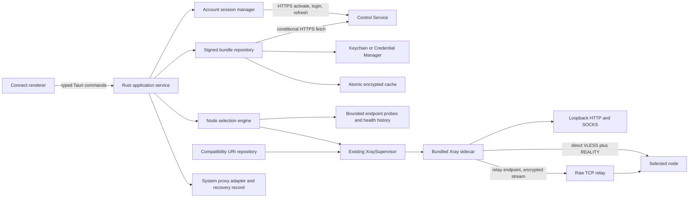

# Connect Architecture

Status: authoritative Connect runtime and local-data design.

## 1. Repository Boundary

Connect remains the independent Tauri application under `client/`. The repository-root Control
application is a separate product and process boundary.

```text
reality-console/
├── src/                         # Control renderer
├── src-tauri/                   # Control backend
├── client/
│   ├── src/                     # Connect renderer
│   └── src-tauri/
│       ├── src/core/            # protocol normalization and Xray config generation
│       ├── src/process.rs       # existing bundled Xray supervisor, extended in place
│       ├── src/profile.rs       # existing compatibility URI repository
│       └── binaries/            # target-suffixed Xray sidecars, generated for builds
└── docs/client/
```

Account and bundle support adds services around the existing supervisor. It does not fork the
supervisor or replace compatibility import before account mode is proven.

## 2. Runtime Topology



The Control Service distributes identity and configuration but is not in the member traffic path.
The renderer cannot access credentials, signed payload bytes, generated Xray configuration,
filesystem primitives, process primitives, or arbitrary probe targets.

The installed executable also has a closed `headless --output <absolute-path>` mode for operator
automation and release acceptance. Requests are bounded, deny unknown fields, and arrive only on
stdin; setup codes are held in zeroizing memory and have no argument or environment-variable form.
Release acceptance drives this interface through `run-connect-network-scenario.py`. Its proof file
contains only stable outcomes and digests, is owner-only, and is bound to the exact package, binary,
source commit, release target, and CI attempt. A proof cannot be reused by another lifecycle job.
Results contain only the same safe snapshots as the renderer and use create-new `0600` files on
Unix. A connect request uses explicit selection and proxy modes, emits a ready snapshot, runs for a
bounded interval, then stops Xray, restores owned proxy state, emits a final snapshot, and exits.
It reuses `ConnectRuntimeRegistry`; there is no separate test data plane.

## 3. Backend Services

### `account_session`

Owns activation, optional password login, access-token memory, refresh rotation, logout, and current
device identity. It serializes refreshes so concurrent API calls cannot rotate the same credential
twice. Activation and login persist device keys, nonce, and operation identity before network I/O.
Refresh persists a generation-scoped idempotency key beside the source credential. Exact retries
therefore reproduce the same signed request and server response after a process or network failure.
It stores the refresh credential under an account/device-scoped key in the OS credential store and
commits a replacement before deleting the prior value.

Session restoration and bundle availability are separate states: Control Service failure may make
online authentication unavailable while an unexpired verified cache still permits data-plane use.
Authentication rejection, device revocation, and ordinary network failure therefore have distinct
stable error codes.

### `control_api`

Implements the versioned `/v1` member API over HTTPS:

- `POST /device-activations/consume`
- `POST /sessions`
- `POST /sessions/refresh`
- `GET /me/profile-bundle` with `If-None-Match`
- `DELETE /me/devices/{deviceId}/session`

Requests are bounded and cancelable, use request IDs for diagnostics, and apply exponential backoff
with jitter only to retryable failures. The module returns versioned domain DTOs and never passes
raw HTTP bodies or bearer tokens to the renderer.

### `bundle`

Parses an untrusted envelope, canonicalizes the signed payload according to the protocol version,
verifies it against a trusted signing key, and validates:

- schema and minimum-client compatibility;
- `network_id`, `user_id`, and current `device_id` binding;
- `bundle_id`, issue, refresh, and hard offline-expiry times;
- account state and unique stable node IDs;
- supported direct or relay endpoint shape;
- each node's VLESS + REALITY configuration and per-node credential.

Validation completes before any secret is exposed to the config generator. A verified bundle is an
immutable value object. Selection and rendering use derived views rather than mutating the bundle.

### `bundle_repository`

Maintains two generations, `active` and `previous`, plus a small non-secret index. Replacement is:

1. verify the complete candidate in memory;
2. write and sync an authenticated encrypted candidate file, with its random encryption key stored
   under a candidate `bundle_id` key in Keychain or Credential Manager;
3. atomically replace the non-secret active-generation pointer;
4. retain the previous generation until the new one can be read, decrypted, reverified, and used;
5. garbage-collect superseded credentials and cache files after commit.

This ordering makes a crash recover to either complete generation. The encryption key and all
refresh or URI credentials remain outside ordinary app data. Cache reads always reauthenticate the
encrypted file and reverify the Control Service signature before use.

### `selection`

Consumes only verified bundle nodes and persisted non-secret policy:

- `manual(node_id)` preserves explicit choice;
- `automatic` ranks eligible healthy nodes using signed hints, bounded probe results, latency
  tolerance, failure threshold, and hold-down time;
- `fallback([node_id])` advances through an explicit ordered subset after bounded failure.

Health history is advisory and scoped by node ID plus endpoint revision. It cannot add an endpoint
or override signed direct/relay mode. Decisions return a selected node and reason code, are
serialized with connection transitions, and avoid switching a healthy session for insignificant
latency differences.

### `core::config`

Extends the current deterministic config generator to accept a normalized `ConnectionProfile`
from either a verified bundle node or the existing compatibility parser. Bundle-specific metadata
never reaches Xray. The generator continues to produce loopback-only HTTP and SOCKS inbounds and one
selected outbound.

### `process::XraySupervisor`

The existing supervisor remains the sole owner of the bundled sidecar and is extended to:

- accept normalized connection input rather than only an imported profile ID;
- serialize stop/start when selection changes;
- validate a candidate with the bundled Xray before activation;
- capture bounded redacted diagnostics and monitor unexpected termination;
- coordinate proxy restoration and runtime-config cleanup on every failure path;
- preserve idempotent start and stop semantics and enforce one child process.

It still executes the sidecar directly without a shell, waits for loopback listeners, generation-
guards asynchronous termination, and atomically writes ephemeral owner-only configuration.

### `system_proxy`

Implements platform adapters behind one contract. It snapshots the exact current OS proxy state,
writes a durable recovery record before mutation, applies Connect's loopback endpoint, and clears
the record only after successful restoration. Startup recovery runs before session restoration or
connection commands.

### `compatibility_profile`

Retains the existing strict `vless://` parser and profile repository. The imported URI remains in
the OS credential store. The module emits the same normalized `ConnectionProfile` consumed by the
config generator and supervisor but has no account, refresh, bundle, automatic selection, or
fallback behavior.

## 4. State Model

Authentication, configuration availability, and connection lifecycle are orthogonal.

```text
Session:     SignedOut -> Activating/LoggingIn -> SignedIn -> Refreshing
                  ^                               |    |
                  +--------- LoggedOut/Revoked <--+    +-> OfflineAuthenticated

Bundle:      None -> Fetching -> Current -> RefreshDue -> CachedValid -> Expired
                         |          ^              |
                         +-> Rejected (keep prior)-+

Connection:  Disconnected -> Probing/Selecting -> Starting -> Connected
                    ^                                  |          |
                    +----------- Stopping <------------+----------+
                                                       |
                                                       +-> Failed
```

`OfflineAuthenticated` means the online session cannot currently be refreshed, not that a bearer
credential remains valid. It permits connection only when `Bundle = CachedValid` and the hard
offline deadline has not passed.

Only one connection transition and one credential rotation may execute at a time. A bundle refresh
does not restart Xray unless the active node's effective connection profile changed, disappeared,
or became ineligible. Expiry, explicit logout, or account revocation stops app-managed connectivity
and restores system proxy state.

## 5. Direct and Relay Data Paths

Direct node:

```text
Application -> loopback proxy -> Connect Xray -> verified node endpoint -> node Xray -> Internet
```

Relay-backed node:

```text
Application -> loopback proxy -> Connect Xray -> raw TCP relay -> node Xray -> Internet
```

Both paths use the selected node's VLESS + REALITY identity. In relay mode the signed node profile
contains the assigned relay endpoint while retaining the selected node ID and node-owned security
parameters. The relay forwards opaque TCP and cannot become the logical exit. The UI receives only
safe path metadata: node ID, label, region, `direct`/`relay`, health, latency bucket, and selection
reason.

## 6. Local Storage and Trust Boundaries

| Data | Owner | Storage |
| --- | --- | --- |
| Refresh credential | `account_session` | Keychain / Credential Manager |
| Access token | `account_session` | Memory only |
| Bundle signing trust | `bundle` | App trust configuration plus authenticated rotation metadata |
| Signed secret-bearing bundle | `bundle_repository` | Authenticated encrypted app-data file |
| Bundle encryption key | `bundle_repository` | Keychain / Credential Manager |
| Imported URI | `compatibility_profile` | Keychain / Credential Manager |
| Installed account binding and controller trust | application service | Versioned native credential-store record |
| Node labels, selection policy, health history | `selection` | Non-secret atomic app-data files |
| Runtime Xray config | `XraySupervisor` | Ephemeral owner-only runtime file |
| Prior system proxy state | `system_proxy` | Durable non-secret recovery record with owner-only access |

The Rust backend owns every trust decision and secret. Tauri capabilities expose only coarse domain
commands. Logs and support data use redacted IDs and stable error codes; secret-bearing types have
redacted debug representations and cannot be serialized into renderer DTOs.

## 7. Tauri Command Contract

Commands are coarse-grained and versioned around user intent:

- `connect_get_snapshot()`
- `connect_activate(activation)`
- `connect_login(credentials)`
- `connect_refresh_bundle()`
- `connect_logout()`
- `connect_set_selection_policy(policy)`
- `connect_probe_nodes()`
- `connect_start()`
- `connect_stop()`
- `connect_update_settings(settings)`
- `connect_preview_compatibility_uri(uri)`
- `connect_import_compatibility_uri(uri, name)`
- `connect_list_compatibility_profiles()`
- `connect_delete_compatibility_profile(profile_id)`

`connect_get_snapshot` returns safe account, bundle-freshness, node-view, selection, path, local
proxy, and error state. Commands return stable error codes and safe request IDs. Passwords,
activation secrets, and compatibility URIs are write-only command inputs and never echoed.

## 8. Startup and Recovery Order

1. Initialize logging with redaction before loading state.
2. Recover and restore any app-owned system proxy mutation.
3. Remove stale runtime config and reconcile any previously managed Xray child where the platform
   allows reliable ownership detection.
4. Load non-secret local metadata and credential-store references.
5. Load, decrypt, authenticate, and reverify the active bundle cache; fall back to the previous
   complete generation if needed.
6. Restore the account session when possible and refresh due bundle state in the background.
7. Reconnect only if the member enabled reconnect and a verified, unexpired connection source is
   eligible.

No startup error may skip proxy recovery. Corrupt cache or missing credentials produces a
recoverable signed-out/cache-unavailable state and does not trigger destructive regeneration.

The implemented registry performs this account/cache restoration lazily before every public
account operation. It runs bounded backend-owned TCP probes only for signed bundle endpoints,
refreshes bundles approximately every six hours, and maintains connected health every 30 seconds.
Neither background path starts Xray when the member left it disconnected. Durable system-proxy
recovery is implemented through a serialized, owner-only, size-bounded journal. Platform commands
run off the desktop thread without a shell; macOS captures each enabled network service and Windows
uses WinINet per-connection settings. Startup and every Xray mutation join the same recovery gate,
so an immediate connect cannot race crash restoration.

## 9. Packaging

Tauri `externalBin` resolves target-suffixed Xray sidecars prepared from the pinned manifest:

- `xray-aarch64-apple-darwin`
- `xray-x86_64-apple-darwin`
- `xray-x86_64-pc-windows-msvc.exe`

CI downloads the declared official release asset, verifies SHA-256, extracts only the expected
binary, renames it for the target triple, and builds the matching package. macOS outputs are signed
and notarized for Apple Silicon and Intel; Windows x64 outputs use code signing and an installer
that supports upgrade and uninstall recovery.

Release configuration supplies the production Control Service origin and bundle signing trust.
Development origins, local CAs, debug capabilities, and mock signing keys are impossible to enable
in a production build through renderer input or ordinary settings.

## 10. Failure Semantics

- Control Service unreachable: back off refresh and use an unexpired verified cache.
- Authentication rejected, device revoked, or refresh-token reuse detected: stop app-managed
  connectivity, restore proxy state, remove that device's local session and cached connection
  secrets, and require activation/login; never retry indefinitely. A client that is offline cannot
  discover a remote revocation and remains bounded by the signed bundle's offline deadline.
- Candidate bundle invalid: keep the prior verified bundle and expose a non-secret integrity or
  compatibility error.
- Cached bundle expired: stop Xray, restore proxy settings, and require online refresh.
- Selected node unavailable: apply bounded retry, then automatic or pinned fallback policy; manual
  mode fails without silently selecting an unapproved node.
- Relay unavailable: mark only affected relay paths unhealthy.
- Xray exits or fails validation/readiness: clean runtime state, restore proxy settings, and retain
  the selected policy for explicit retry.
- Credential store unavailable: do not write secrets to app data; expose recovery guidance.
- Port occupied: fail before Xray launch or system proxy mutation.
